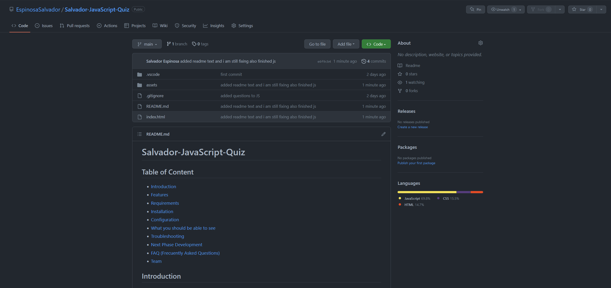
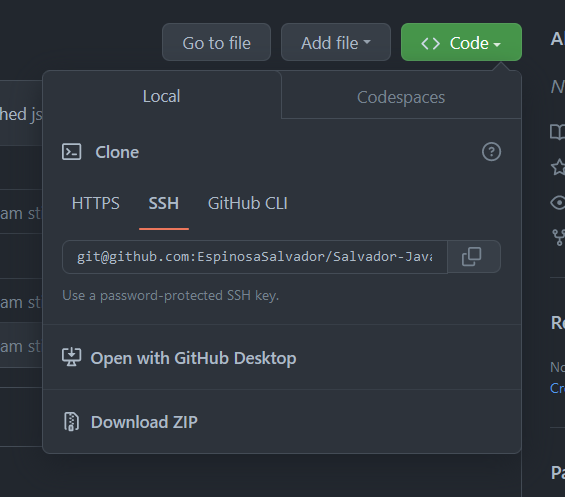
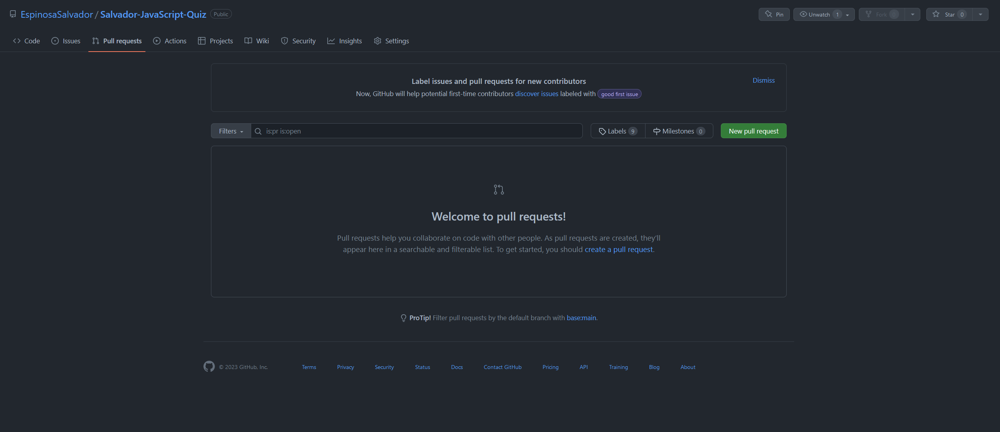
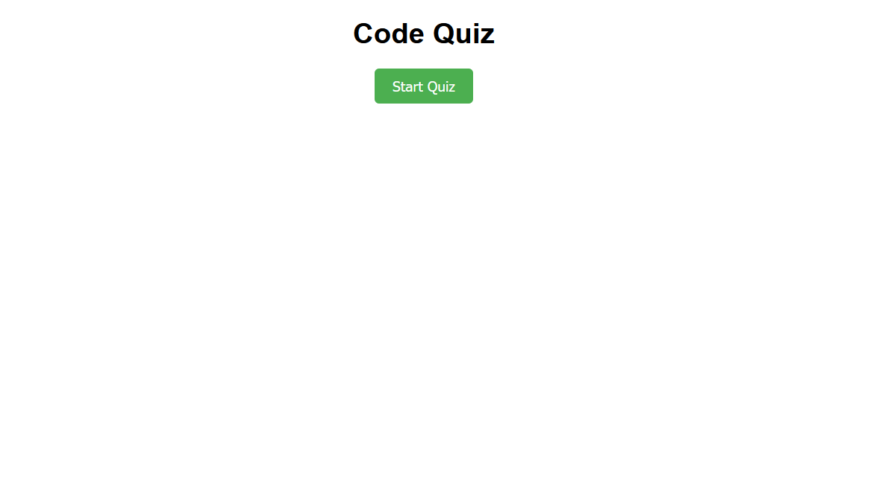
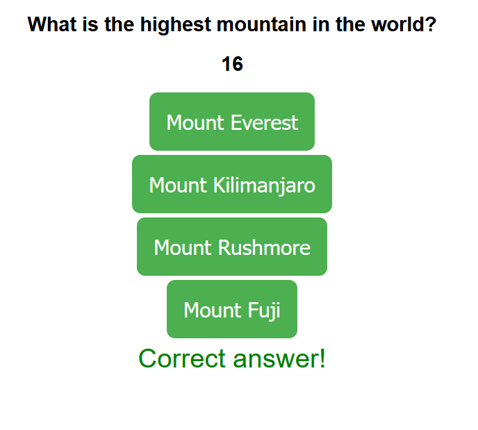

# Salvador-JavaScript-Quiz

## Table of Content

* [Introduction](#introduction)
* [Features](#features)
* [Requirements](#requirements)
* [Installation](#installation)
* [Configuration](#configuration)
* [What you should be able to see](#what-you-should-be-able-to-see)
* [Troubleshooting](#troubleshooting)
* [Next Phase Development](#next-phase-development)
* [FAQ (Frecuently Asked Questions)](#faq-frecuentrly-asked-questions)
* [Team](#team)

## Introduction

This is a JavaScript quiz app that presents the user with a set of questions and multiple choices for eah question. The user can select an answer for each question and the app checks whether the answer is correct or not. the user has a limited amount of time to complete the quiz, and their final score is based on the number of correct answers and the remaining time.

## Features

* Randomized questions: The app presents the user with a randomized set of questions each time they start the quiz.
* Multiple choices: Each question has four possible answers and the user must select one of them.
* Timer: The user has a limited amount of time to complete the quiz. If the time runs out, the quiz ends automatically.
* Score tracking: The user's score is based on the number of correct answers and the remaining time.
* High score tracking: The app saves the user's high score in the local storage.
* Save user's score: The app allows the user to save their score and initials in the local storage.

## Requirements

the requirements to run this webpage are really low due that we are only using *HTML*, *CSS* and *JS*.

* Vs code
* GitHub
* Internet
* Download JS to its latest release.

## Installation

To install this project please proceed to my [GitHub Repository](https://github.com/EspinosaSalvador/Salvador-JavaScript-Quiz)

you should be able to see this,



Click on code as shown in the image



Copy the SSH key or the HTTPS key and open.

* Terminal
* Git bash
* CMD

either one of this will work. please proceed to the terminal an put in your Terminal,

```
git clone git@github.com:EspinosaSalvador/Salvador-JavaScript-Quiz.git
```

and now you have a copy of the code.

## Configuration

If you want to do any configurations on this project please open a new branch you can do this by putting the following code in your terminal,

```
git checkout -b ＜new-branch＞
```

switch branches putting the following code on your terminal.

```
git checkout ＜branchname＞
```

If you want to show us your code and merge please open a pull request on [Github](https://github.com/EspinosaSalvador/Salvador-JavaScript-Quiz/pulls).



## What you should be able to see

[here is the link of the webpage on github pages.](https://espinosasalvador.github.io/Salvador-JavaScript-Quiz/)

These is what you should be able to see in the Webpage,


Please proceed to click on to start the quiz. 


please continue and select your answer in this example lets say I choose the wrong answer

As you can see in the image below there is a legend that states that 10 sec will be substracted

.png)

and if we choose the correct answer. we will be send to the next question right away. and also we will get feedback on if it was correct or not



if we let the timer run we will be presented with the end of the quiz with 0 score


please click on save score so it can be saved in local storage.

## Troubleshooting

The quiz is in version 1.0, please let me know if there are anybug in the webpage by issuing it in [Github](https://github.com/EspinosaSalvador/Salvador-JavaScript-Quiz/issues)

this are the known issues.

* LocalStorage is not saving the initials. don't know at the moment what I am missing. would love to hear from you guys what error you see in my code :).

* timer is not staying down. it does go down but after a second it returns to the previous time.


## Next Phase Development

This are will be updated depending on the feedback from the users.

## FAQ (Frecuentrly Asked Questions)

We will update this part when we have some frequently asked question.

## Team

* Salvador Espinosa Valdez
